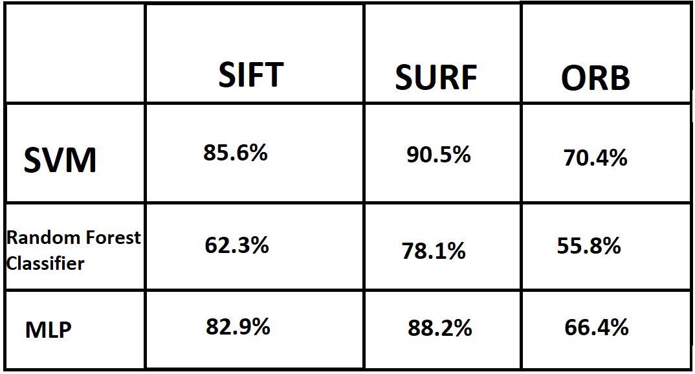

# Hand-Sign-Detection
Implemented various techniques for static hand sign understanding. Initially started out with the MNIST sign dataset available in the kaggle and then moving on a more bigger dataset available at this [link](https://drive.google.com/open?id=1wgXtF6QHKBuXRx3qxuf-o6aOmN87t8G-). I applied various image processing technique including edge detection, feature detection, and extraction etc. Also, I used CNN architecture as well as transfer learning using inception model, I also used various machine learning classifier which works on image feature extracted.

## Sign MNIST based model
- I started with very basic dataset available at this [link](https://www.kaggle.com/datamunge/sign-language-mnist) and created a three-layered CNN based model with max-pooling at first two layers and two fully connected layers.
- With 125 epochs of training, the model got an accuracy of 98.28% on the test set.
- The dataset has 27455 training samples which are 28 * 28 pixels so when this model tested on webcam input it does not tend to perform well given getting very good accuracy in the test set.

## Improved sign dataset
- [This](https://drive.google.com/open?id=1wgXtF6QHKBuXRx3qxuf-o6aOmN87t8G-) dataset is hand created is much more difficult to work with having 480 * 640 images and reflects good properties to make model deployable for real-world hand inputs.
- Similar model architecture is being used as for sign MNIST but an extra convolution layer is added with max-pooling layer. Batch normalization is applied in the first two layers as it tends to perform better results.
- WIth 100 epochs of training, the model achieved 94.5% accuracy on the test set.
> #Note- The images in the dataset is resized to 128 * 128 pixels and also to grayscale.

## Image classification using feature extractors
- Here I tend to work on classic image processing techniques for hand sign recognition.
- I used the improved dataset and applied edge detection and then try to extract the features in the image by suing feature extractor algorithms like SIFT, SURF, and ORB. Further, I used the bag of visual word model on the feature extracted by the descriptors and applied K means clustering so that similar features are clustered together. Then created a new feature representation of the images based on the clustering.
- On the new feature representation found on the previous step I tried various Machine learning model and got the following results.

## Transfer learning using inception v3 model
- Pre-trained Inception model is being used and an extra layer is being added onto to create a new inception architecture to classify hand sign.
- To decrease the compute time I stored the transfer values by the model of the training samples ahead of training and saved it onto a pickle file.
- With 500 epochs of training our model tend to achieve an accuracy of 95% and this model also tend to perform well on the webcam input.
